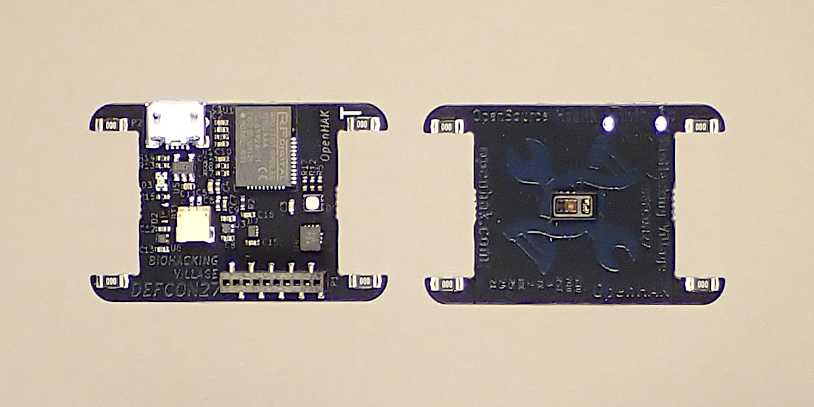
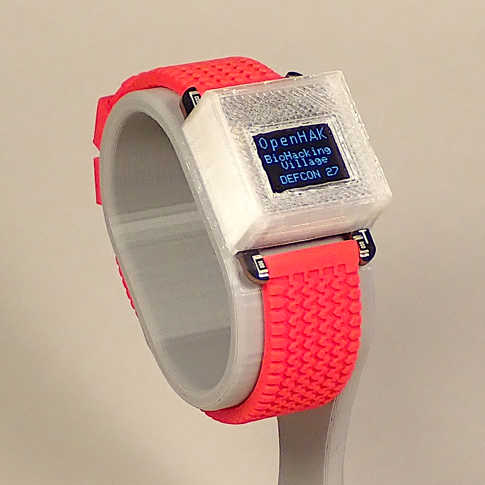

# Biohacking Village Badge Workshop
 
_Biohacking Village DIY Workshops_
 
As part of our commitment to biohacking and open science, this 2019 DEF CON [Biohacking Village](https://www.villageb.io/)  workshop has been converted to a DIY/at home format. We hope you find this project instructive.
 
## About This Workshop
**Workshop leads:** Leif Percifield 
 
During this workshop participants will get the chance to learn about:
 
* The general principles of PPG (photoplethysmography)
* OpenHAK hardware breakdown
* OpenHAK firmware/software breakdown
* Known issues/security fixes
* Future of the project
* Participants can also ask questions about the OpenHAK project and give feedback to improve it.

## PPG (photoplethysmography)
Photoplethysmography (PPG) is a simple and low-cost optical technique that can be used to detect blood volume changes in the microvascular bed of tissue. It is often used non-invasively to make measurements at the skin surface. [Ref](https://www.ncbi.nlm.nih.gov/pubmed/17322588)

It is a popular measurement method in many of the wearable devices on the market today thanks to it being relatively simple and inexpensive. The basic information that can be determined is heartbeat and pulse oximetry (pulse-ox. There is interest in determining other useful information from the data, such as blood pressure and arterial stiffness. 

## OpenHAK hardware
The Open source Health Activity Kit (OpenHAK) board is what was used for the 2019 Biohacking Village Badge. The board has three main components:

* Bluetooth (BLE) - a Simblee BTLE module. It is an OpenHAK Arduino board variant based on the original Simblee board files. 
* BMI160 -  multi-axis MEMS with accelerometer that counts your steps and a touch interface. 
* MAX30101 - MAX integrated heart rate sensor 
* OLED screen (64x48 pixels, 0.66")

There are also a handful of pins (8 for the BETA version) that are user accessible to add other modules, features and as a way to interface with the device. 

Further information on the hardware for the Biohacking Village badge can be here:
https://github.com/biohacking-village/OpenHAK_Hardware/tree/OpenHAK_BHVbadge_DEFCON

## What you will need
A computer 
Biohacking Village/ OpenHAK badge

 

 

 
## Using the Biohacking Village Badge

The Biohacking Village badge/monitor works out of the box and is advertising itself to connect to your phone/tablet. Once connected, it will go through a cycle of deep sleep for 10 minutes, then wake up for 30 seconds to take your pulse and send the data to your phone/tablet. The data payload includes a timestamp, step count, heart rate, and battery level. 

The software has been designed to have three additional data points that it can transmit. These were left unused so that you can configure the them for your own purposes. For example, reporting other sensor readings from something you've hacked into the Biohacking Village badge.  

In order for you to build and use your own add-ons, you have to have access to pins on the Simblee. The badge has 10 pins exposed for user hacking: 

* GND
* 3.0V
* Simblee Reset
* GPIO 3 / Analog 4
* GPIO 1 / Serial TX / Analog 2
* GPIO 2 / Analog 3
* GPIO 0 / Serial RX / Analog Reference
* GPIO 25
* GPIO 24
* GPIO 21

 Some possible hacks
* Add a vibration motor for haptic feedback 
* Integrate the Simblee platform into Arduino to turn the badge into a gesture controller 
* Integrate the Simblee platform into Arduino to do over the air updates
  * To help with this, we hacked the Simblee board files for Arduino to respond to a button touch by producing the special ZIP file that is necessary for Over The Air Device Firmware Update (OTA DFU). Check out the gihub documentation for more details.
* Have the MAX sensor report the temperature (which is right on your wrist) using one of the unused data slot

 

## Resources
[OpenHAK Hardware repo](https://github.com/biohacking-village/OpenHAK_Hardware)

